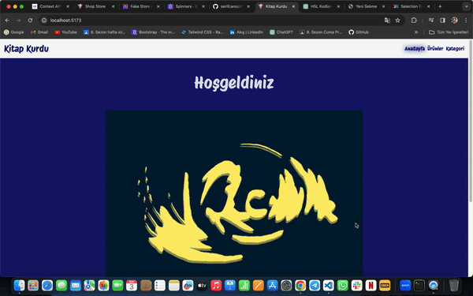

# Link

- Proje içerisinde yönlendirme işlemlerinde a etiketi yerine kullanılır.
- Href yerine to değeri yönlendirilecek sayfayı belirler.

# Navlink

- Link etiketi ile aynı görevi yapar.

- Kullanıcı eğer ki o linkin to değeri ile yönlendirme yaptığı sayfada ise link aktif class'ı alır.

# Dynamic Route

- Sayfa içeriğinin url'den alınan parametrelere göre değiştiği sayfalara verdiğimiz isim

- Örnek:

- Youtube video sayfası
- Netflix film detay sayfası
- Amazon ürün sayfası

# useLocation

- Kullanıcının bulunduğu sayfa ile ilgili bilgileri alır.

- state / path / hash / param

# useNavigate

- Linkin fonksiyon karşılığı

- Kullanılabilmesi için bir kere çağrılması gerekli bileşende

- const navigate = useNavigate();

# Search Params (arama parametresi)

- normalde state de tutacağımız değerleri arama parametresinde tutmak isteyebiliriz

- State de tutulan veriler sayfa yenilendiğinde kaybolur

- Ama arama parametreleri için böyle bir durum söz konusu değildir.

- Bu yüzden sayfa yenilenince kaybetmek istemeyeceğimiz örneğin filtreleme değerlerini arama parametresi olarak tutarız

# Nested Router (İç içe yollar)

# bookstore-react

Merhaba! 📚 Yenilikçi bir web deneyimi olan kitap mağazası tarzı bir web sitesi tasarladım. React.js ve Bootstrap gibi modern teknolojilerle geliştirdim, böylece kullanıcılar her türlü cihazda sorunsuz bir şekilde gezinebilirler. Verileri yönetmek için basit ve etkili bir API kullandım ve bu sayede Axios ile API üzerinden veri çekerek kitaplarla ilgili bilgileri anında ekrana yansıtabildik.

Bu proje, hem kullanıcı dostu bir arayüz sunmak hem de teknolojiyi kullanarak verimliliği artırmak için yapıldı. Kitap severlerin ihtiyaçlarını karşılamak için tasarlanmış olan bu web sitesi, geniş bir kitap koleksiyonunu keşfetmek isteyen herkes için idealdir.

<h1>ScreenShot</h1>

